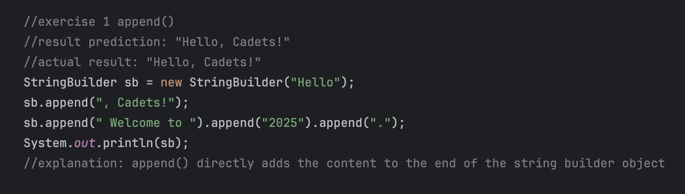
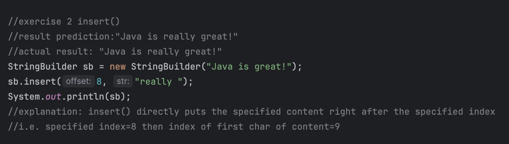
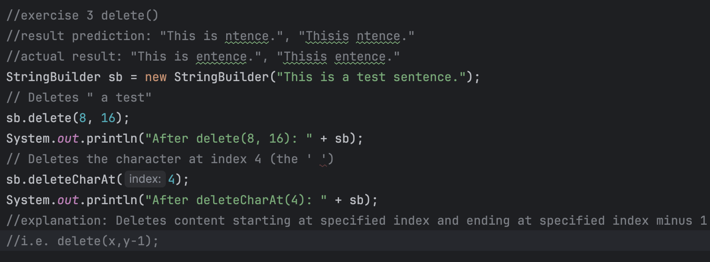
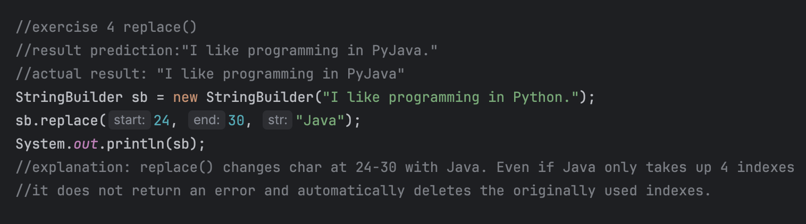
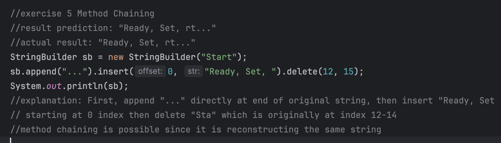
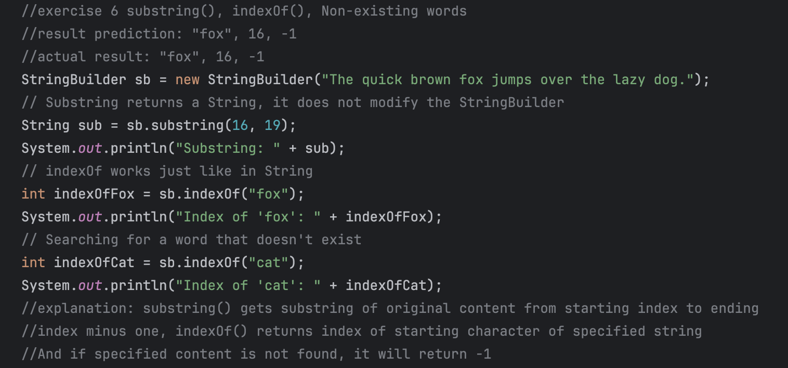
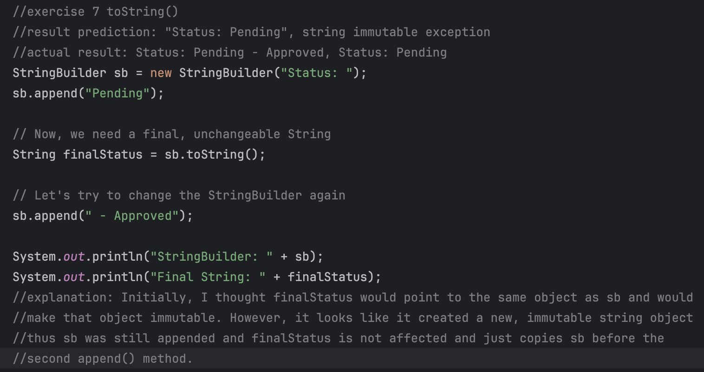

# Lab: Exploring Java 'StringBuilding'

### by: Ivan Patrick Frondozo

## Description:

This Java program explores the StringBuilder class of Java by executing different StringBuilder methods and testing different cases to learn more about its use cases.

## Output:

### Exercise 1: append()

### Exercise 2: insert()

### Exercise 3: delete()

### Exercise 4: replace()

### Exercise 5: Method Chaining

### Exercise 6: substring(), indexOf(), Non-existing words

### Exercise 7: toString()

